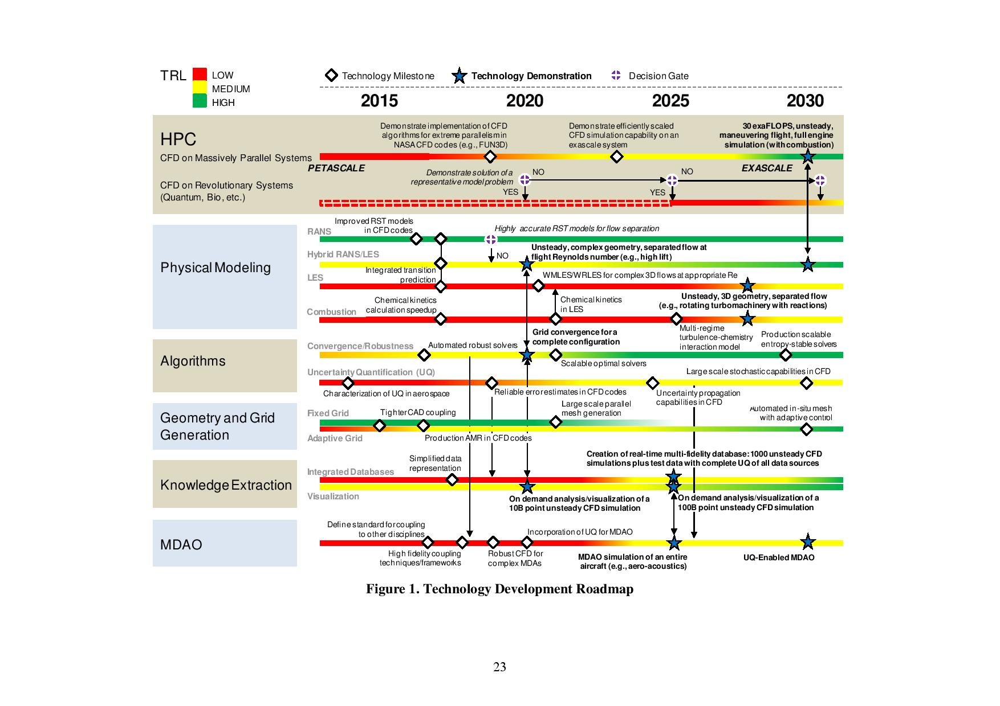
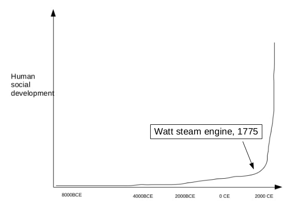

On June 5-9 2017, I participated in the AIAA Aviation 2017 Forum, which is really amazing. Thousands of scholars/scientists/engineers from all over the world came together to Denver, CO to present their research and also share their opinions. The topics cover every aspects of the aviation science and technology. The most exciting and open-minded topic is to foresee the future of CFD and how to achieve it. In university, I always think that the CFD is already in somewhat mature status, we just need to invent some new parts to replace with the corresponding old parts in the entire CFD ‘building’. However, after I read the paper by P.R.Spalart and V.Venkarakrishnan [[1]](https://www.cambridge.org/core/journals/aeronautical-journal/article/on-the-role-and-challenges-of-cfd-in-the-aerospace-industry/AB70FEF00301B20648F5B0627893B787), I become more objective and calm. It says “We perceive a danger of **overconfidence** and under-competence in CFD” and “We believe the community must find a **balance between enthusiasm and rigor**”. I realize that there are still tons of obstacles in front of us to overcome. The role of CFD in service is still very limited. 

<!-- more -->
In fact the original prediction is from the *CFD vision 2030* [[2]](https://ntrs.nasa.gov/search.jsp?R=20140003093). It points out this attracting roadmap of CFD

I will merge the ideas from some related papers and presentations below:

## Investment 
* Investment has been declined much in the last decade
* Safety is the most important factor, so the penetration of CFD is gradual
* The initial cost of CFD can be lower than the wind-tunnel test, but if hundreds of conditions are needed to be measured, the cost comparison switches

## HPC hardware 
* HPC hardware has rapid progress (parallelism and heterogeneous architectures, multiple processors/accelerators). 
* Some other novel technologies are emerging, line quantum computing, superconducting logic, low-power memory, massively parallel molecular computing, on-chip optics, 3D memory and so on. On 2030, we may get 30 exaFLOPS on the top supercomputers. However, we have the following impediments:
    - Power consumption
    - To facilitate CFD development, we need higher level of software extraction in terms of OS, compiler, I/O lib and so on
    - Call for advanced programming environments, which need proper level of abstraction. The most often headache for me is to handle the libraries compatibility when compiling my code on different supercomputers
    - Robust CFD code scalability. I think the high order CFD methods have big advantage on this issue because of its compactness.
    - Lack of scalable CFD pre- and post-processing methods. On the frontend, we need geometry representation and mesh generation. On the backend, we need visualization, database generation and general knowledge extraction
    - Lack of access to HPC resources in development level.
    - Before 2012, the rate of growth of computing capability is of the order of a factor of 3.8 every two years. However, after 2012, it is only a factor of 1.8 every two years, which has 57% dropdown. In post-Moore’s law era, the “free” progress is **over-estimated**

## Physical modelling
* RANS is not enough to accurately and reliably predict turbulent flows with separation. The pre-separation physics is still provided by RANS models, which has been stagnant for 20 years. 
* LES is impractical in the foreseeable future. 
* Hybrid RANS-LES and wall-modelled LES are the best promising. The LES for predicting complex turbulent-separated flows and the RANS region will be minimized for efficiency
* Accuracy and convergence issues of the models
    - Converged solution? There are no consistent measurements for measuring convergence. The uniform refinement is far from satisfactory when doing grid convergence study.
    - Even converged, There are multiple solutions, so which one reflects reality?
    - The real-world experiments’ data have not been conveniently and effectively exploited to improve turbulence study
* other physical model: transition, combustion, renormalization group theory, systematic upscaling....
* Lack of explicit collaboration among turbulence researchers all over the world. I think more and more common interfaces should be setup to make the communication and collaboration more natural. Education should play a role into this part.
* The treatment of turbulence will not be a solved problem in the 21st century. However, **TILDA**[[3]](https://www.grc.nasa.gov/hiocfd/) thinks this conclusion is based on classic 2nd order schemes, we have many other novel techniques: High order methods, GPU, multilevel, multiscale, IMEX...

## Mesh generation
* Mesh generation and grid adaptivity are still the bottleneck in CFD workflow and very little investment
* Even the geometry representation is not good enough for CFD
* Solution adaptive refinement of grid is necessary to get grid-converged results
* Self-gridding is essential for CFD, but currently immature.
* For high order method, the accuracy of geometry & surface and volume gridding technique is immature

## Algorithmic improvements 
* The alogrithms (discretizations, solvers) act as the same important role as the computer hardware. To exploit the rapidly evolving HPC hardware, algorithmic developments will be essential
* Higher order methods may utilize the latest HPC hardware more efficiently, but robustness and cost considerations remain
* For 3D RANS unsteady flow, the use of error estimation and uncertainty quantification is limited. This issue needs more researchers from other related fields to walk into and leverage those technologies for aerospace applications. For longer expectation, the statistical approaches such as Bayesian techniques can be applied
* So many different kinds of CFD methods have no clear winners and losers up to now. I think this problem needs more fair and systematic comparisons between different methods, which is exactly one part of what the High Order CFD Methods Workshop is doing.

## Knowledge extraction
* Exploiting the big data from large-scale simulations is still in infancy
* We can not effectively use a single high fidelity CFD simulation, even the visualization for high order simulations is lacking. I also think most data of CFD is wasted. I generate several TB CFD data, which can only lay on my external hard drive
* Merging the high fidelity CFD simulations with other aerodynamic data is also required for efficient CFD

## Multidisciplinary simulations 
* For both analysis and design optimization purposes in multidisciplinary simulations, the robustness and automation of each component is required
* Integrate with other disciplines like acoustics, structures, heat transfer, reacting flow, radiation, dynamics and control and so on
 
Although there are some different opinions towards the future status, which is the beauty of science I believe. From a big overview, all scientists agree well with the future directions which should be concentrated on more. It is very hard to predict the future exactly, especially in this rapidly changing era. The following figure from *Why the West Rules-for Now* by lan Morris shows the human development index in the recent 10,000 years[4]. Since the Watt steam engine was introduced, the human social development index is speeding up extremely. So, we can image a similar figure for CFD. I personally think we still live in before 1775, so what will be the Watt steam engine for "CFD development index"? Everyone may have some candidates in minds. For me, one candidate is quantum computing and another candidate is mature high order FR/CPR method (Flux Reconstruction/Correction Procedure via Reconstruction). Luckily, I am extending the latter one.

From *The Second Machine Age* [5], the digital technology has exponential evolving property. The HPC will continue to contribute exponentially to our CFD, but CFD is not entirely a digital technology, because the air, water as well as our blood are not that different from humans living in 10,000 years ago. Although CFD can not get exponential speedup, I think CFD is a bridge connecting the physical and the digital world. As a PhD student in this area, being objective, honest and passionate is the most important. To get those many achievements mentioned above, I hope much more students/scholars could enter into or at least pay close attention on computational science field (e.g. CFD). With more and more talents, I think we can find the "Watt engine for CFD" in the near future. In a word, I am very impressive in this successful conference and eager to participate in the next one.
 
## References:
[1] Spalart, P.R. and Venkatakrishnan, V., 2016. On the role and challenges of CFD in the aerospace industry. The Aeronautical Journal, 120(1223), pp.209-232.
[2] Slotnick, J., Khodadoust, A., Alonso, J., Darmofal, D., Gropp, W., Lurie, E. and Mavriplis, D., 2014. CFD vision 2030 study: a path to revolutionary computational aerosciences.
[3] TILDA: Towards Industry LES/DNS in Aeronautics Paving the Way for Future Accurate CFD 2017. Presented by Charles Hirsch on AIAA-AVIATION 2017 Special Session.
[4] Morris, I., 2010. Why the west rules-for now: The patterns of history and what they reveal about the future. P142.
[5] Brynjolfsson, E. and McAfee, A., 2014. The second machine age: Work, progress, and prosperity in a time of brilliant technologies. WW Norton & Company.
