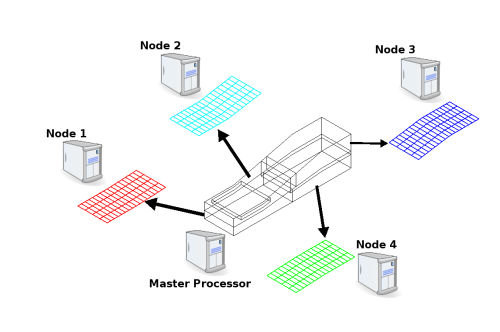
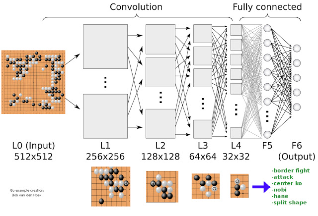
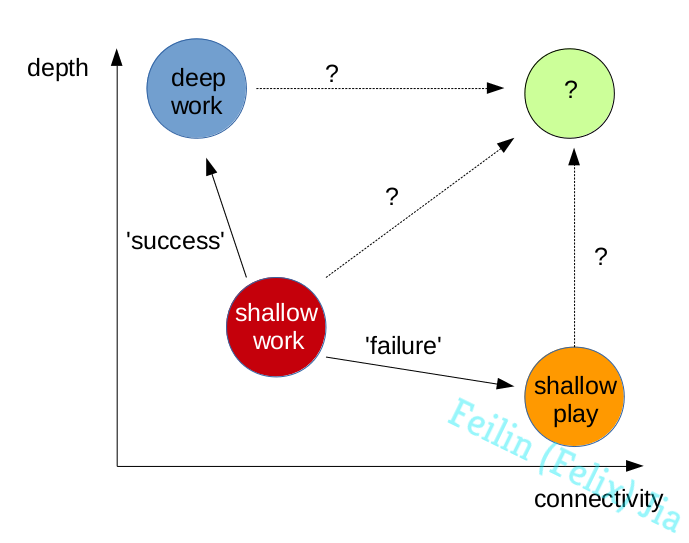

**Keywords**: deep/shallow work, knowledge worker, distraction, value of work

A book named *Deep Work: Rules for Focused Success in a Distracted World* by Cal Newport intrigued me recently. It is not like a traditional inspirational book (心灵鸡汤 in Chinese), instead, it attempts to formalize and explain the reasons as well as the strategy of deep work in neurological, psychological and philosophical scopes. In this highly distracted world, countless emails, instant messages, and tighter social connections will destroy our consecutive time into many small chunks. To thrive in the coming digital and intelligent revolution, the author, Cal Newport, suggests us to embrace the depth instead of the connectivity. His idea sounds like technophobia for me, so I can not totally agree with him, but some questions puzzles me a lot after reading that book, which I will go over with some of my immature thoughts at the end.

<!-- more -->
The author firstly gives two definitions:

**Deep work**: professional activities performed in a state of distraction-free concentration that push your cognitive capabilities to their limit. These efforts create new value, improve your skill and are hard to replicate.

**Shallow work**: Noncognitively demanding, logistical-style tasks, often performed while distracted. These efforts tend to not create much value in the world and are easy to replicate.

Most knowledge workers are doing shallow work. A lot of suggestions for integrating deep work into professional life are given for different kinds of persons in the book. I just put a part of them here:

Deep work is valuable because it can generate the comparative advantage, then stands out in this 'winner-take-all' market. About the 'winner-take-all' in the information world, it is due to the extremely much lower marginal cost compared to other physical products. I highly recommend the other book named *The Second Machine Age* by Erik Brynjolfsson and Andrew McAfee from MIT. Although I am just a student in a specific area of CFD, I have realized that even if a CFD software can be 1% better than others, it will take over most of the market and its price will be much higher than others.

Deep work is rare because our current most knowledge work lacks clear and instantaneous feedback (like fitness T_T), we will tend toward behaviors that are easiest at the moment: shallow work. From my point of view, this point is related to its first point, because normally the value can be equivalent to the scarcity.

Deep work is meaningful, because the meaning of work does not come from the specific work itself, but the skill and appreciation inherent in craftsmanship. I highly agree with as well as appreciate to this point of view, because it releases me from the limitations of the specifics and projects me to a boarder scope.

However, an interesting thing for me is the sharp contrast between most common daily life against the meaningful counterpart expected by the author. In fact, we never lost addiction and concentration in this distracted world, but mostly in the virtual games instead of the real lives. I may call it "shallow play". Why our human's brain is hard to handle the value associated with connectivity in the real world? Generally, for machine's brain, connectivity will perform more depth. Like in CFD, parallel computing helps us to find the deeper physical essence of the turbulence. This kind of 'steady and free progress' relies on the exponentially growing size, as well as the connectivity, of CPU cluster. A figure about the parallel processing for the Masses is shown below. A job can be split into several children tasks to be processed individually and then communicated through the connectivity. Another example is the Alphago developed by the Deepmind. The optimized strategy going deep of the Alphago comes from the fully connected 'neuron network'.

(from innovative-cfd.com)[[1]](http://www.innovative-cfd.com/parallel-processing.html)

(from Bob van den Hoek's blog)[[2]](http://deeplearningskysthelimit.blogspot.com/2016/04/part-2-alphago-under-magnifying-glass.html)

Therefore, after I plot the connectivity and the depth into a single XY-axis figure, some paths are marked by questioning symbol:

Those question marks will be some good topics to consider in the future. I have to go back home, see you next time!

## References:
[1] http://www.innovative-cfd.com/parallel-processing.html
[2] http://deeplearningskysthelimit.blogspot.com/2016/04/part-2-alphago-under-magnifying-glass.html