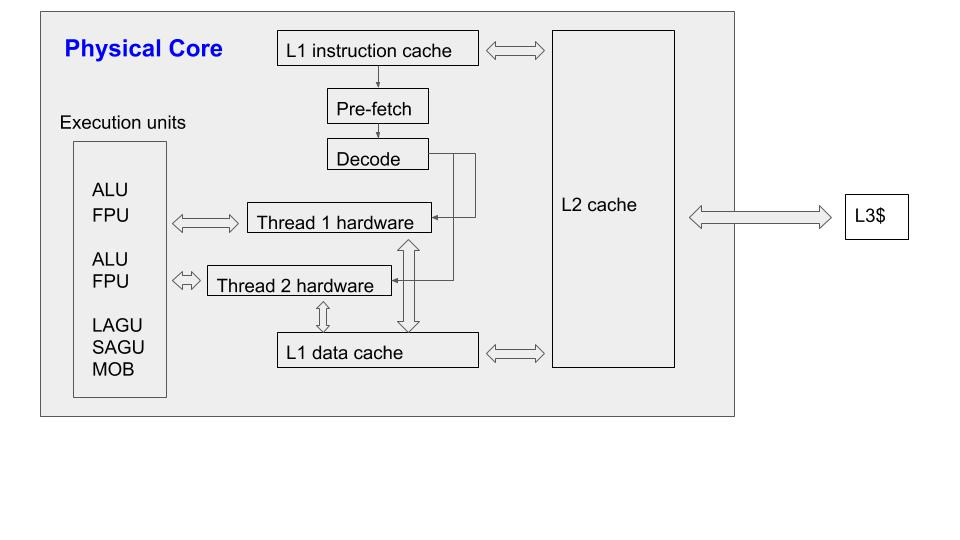

**Q: What are you reading recently?**
A: ***GPU Parallel Program Development Using CUDA***, written by Professor Tolga Soyata in State University of New York - Albany (SUNY Albany).
**Q: I know GPU. It is the acronym for graphic processing unit. Nowadays, many huge video games, like Call of Duty, Battlefield 3, Civilization, etc., require some advanced 3D vitualization capabilities by GPU cards, like Nvidia GeForce GTX 1080 Ti. Even for some online games, like Overwatch, a better GPU card can delivery better 3D vision performance. But... how does it relate to programming?**
A: Your saying is right, but the gaming purpose is only a small portion of the entire GPU world. There are many GPU manufactures, like NVIDIA, AMD, Intel, Asus, etc., with different architectures for various applications and contexts. Here, I only take NVIDIA's GPUs as an example. It has many different series of GPU cards. Although all NVIDIA GPUs support general purpose computation (GPGPU), different series offer different performance features. The GeForce you mentioned is the series for consumer gaming. The GPUs in the book I read belong to Tesla/Quadro series, which is for high performance scientific computing.
**Q: I see...but what's the difference other than the name?**
<!-- more -->
A: There are many differences in various aspects, like floating point capability, error correction, memory, etc, but you can just remember the most evident difference is the price. The price of the latest gaming GPU card, NVIDIA GEFORCE RTX 2080 Ti, is about $1400, while that of Tesla, Nvidia Tesla v100 (16GB), is about $5500.
**Q: Hahaha, the price is everything! OK...let's go back to the book. I heard about programming, but what does the "parallel programming" mean?**
A: This is the key. In fact, because a GPU card normally has thousands of cores, so unlike the serial job running on CPU, the program running on GPU always launches on massive processing units in parallel. Therefore, "parallel programming" means "programming code for executing in parallel".
**Q: I see... so the "parallel" here is related to the hardware feature of GPU card. You mentioned about "serial job running on CPU", but I think that's not always the case, usually a modern CPU has more than one core, so parallel jobs can also run on CPU, right?**
A: Correct. For example, my HP ENVY laptop has Intel i7-4700MQ CPU with 4 cores with hyper-threading technique, which allows each core running up to 2 threads at the same time (8 threads in total), but a parallel program requesting 10 threads could still be able to run.
**Q: I am confused. CPU, GPU, core, thread, task, ... so many concepts. Why could the 10-thread code run on a CPU supporting at most 8 threads?**
A: Don't worry. This is what this book all about. In the first part, it starts from serial to parallel programming in CPU, which provides a solid basics for operating system, CPU and memory. In the second part, it delivers the previous CPU knowledge to the GPU world, because CPU and GPU are the same in the fundamental level. The whole book is full of sketches, analogies and psudo-codes. It reads like telling a story instead of listing knowledge points. Let's get started. The sample code in the book is to flip an input image vertically or horizontally. To simplify it, I just use a simple 2D array (matrix) to represent the image. My final target is to maximize the CPU power to accelerate the entire process by applying many programming rules related to hardware, operating system, compiler, memory access, multi-threading techniques and etc.
**Q: Amazing. Is there any place in which I can access your code?**
A: I will put some critical code directly in this blog, but the entire source is available at ([Check the Source!](https://onlinegdb.com/S1YVv5T4N)). The initial and trivial implementations of two functions called **FlipMatrixV** and **FlipMatrixH** are shown here:

int row = 12800;
int col = 9600;
void FlipMatrixV(int row, int col, int **matrix){
    for(int j=0; j<col; j++){
        for(int i=0;i<row/2;i++){
            int temp = matrix[i][j];
            matrix[i][j] = matrix[row-i-1][j];
            matrix[row-i-1][j] = temp;
        }
    }
}
void FlipMatrixH(int row, int col, int **matrix){
    for(int i=0;i<row;i++){
        for(int j=0;j<col/2;j++){
            int temp = matrix[i][j];
            matrix[i][j] = matrix[i][col-1-j];
            matrix[i][col-1-j] = temp;
        }
    }
}

The wall clock time of executing the above process is


Time cost to flip the matrix vertically is 4.80731182e+00 seconds. 
Time cost to flip the matrix horizontally is 4.41095461e-01 seconds. 


**Q: Why the execution time of horizontal flip is less than 10% of that of vertical flip? The numbers of data movement are the same, right? If I do these two tasks by hand, they would cost similar time for me.**
A: You are exactly right. The computer doesn't do things in the exactly same way as human. Don't worry. The reasons will be explained step by step. I will go back to your problem later. Let's first focus on the multi-threading technique. The above code is very trivial, so I won't explain it.
**Q: OK. I have no experience on multi-threading. I only remember when I was looking around in the computer shop and the sales man advertized the 4 core/8 thread laptop to me. He said that laptop can be treated as an 8-core machine, but only costs money to buy a 4-core machine... then I bought it.**
A: Hmm...in fact, he was not wrong, but omitted many crucial details to you. In fact, the CPU in your laptop only has 4 **physical cores** and each physical core can run 2 threads simultaneously (so called hyper-threading technology), thus in total 8 threads, which are also called **virtual cores**. An 8-physical-core machine is not identical to an 8-virtual-core machine at all. No free lunch!
**Q: What's the difference between the physical cores and virtual cores?**
A: Hardware resources. A physical core has its individual hardware resources (ALU, FPU, cache, etc), but a virtual core (**hardware thread**) resides into a physical core. It only has own register files and has to share most hardware resources with other virtual cores within the same physical core. Here is a sketch of the architecture of one physical core (2 thread).

You see. The two threads share all the execution units, instruction and data streams from L1 cache. It is the reason why the hardware threads are called “virtual” cores instead of "real" cores. Imagine two works are manufacturing cellphones, but they have to share their tools, thus one work has to wait for another when the tools are saturated, so the efficiency can not be doubled. Of course, if the two works can arrange their work orders perfectly to avoid the saturation of tools, things will speedup, so that depends.
**Q: Oh... You should read this book and tell me about this last year before I bought my laptop...**
A: That's not too bad. Currently a 8-physical-core machine is very expensive and unnecessary for everyday use.
**Q: Good. Let's go back to the multi-threading, so I think it's about programming to exploit the 2 threads in the physical core, right?**
A: Not really. To explain the multi-threading programming, we firstly need to make clear that there are two types of "thread". One is called **hardware thread**, another is...
**Q: **software thread**?**
A: Exactly. The "thread" or "virtual core" shown in the above figure is the hardware thread. It is a physical object set in stone by the CPU manufacturer. However, the "thread" in "multi-threading programming" means the software thread, which is usually associated with **task**. One thread is associated with one task. Therefore, "thread" has different meanings in different contexts.
**Q: I see. but how are they related to eath other? I mean... how could I let multiple tasks (software threads) run on multiple virtual cores (hardware threads)? Are they automatic?**
A: Good question. In fact, the mapping from software threads to hardware threads are done by operating system automatically. The OS will always try to assign some particular available hardware resources to execute a software thread maximum performance. However, at the same time, the programmer also has to write some codes explicitly to tell the OS to divide the entire job into several child tasks (software threads). This is the meaning of multi-threading programming. Let's say your laptop has 4C/8T, but if a program is designed to execute on a single virtual core, so about 80% of the hardware resources are wasted. Maybe in 1-2 decades ago, single-core programs were the mainstream, because most CPUs only had one core with single thread at that time. However, nowadays, most manufacturers try to put more and more cores as well as threads to a CPU chip, such as 2C/4T, 4C/8T, 8C/16T, etc.
**Q: Hmm...why don't they try to improve the capability of a single core to create a super powerful single-core CPU? If they did that, programmers would not have to learn this multi-threading programming.**
A: In fact, they can't. The detailed reasons are complex, which I may explain in another blog, but to be simple, the more powerful a single core is, the smaller inside transistors have to be. The size of transistor is already very close to its physical limitation. Also, another big factor is the drastic growing power consumption with the higher transistor's frequency. Therefore, you can even notice an interesting phenomenon that many latest CPUs use even lower frequencies but put more virtual cores inside to improve the overall performance.
**Q: I see... interesting. I also noticed that the CPU frequency doesn't grow like before nowadays.**
A: Let's look at the first example of multi-threading programming. The following code is a function to flip a matrix vertically using multi-threads.

void *MTFlipV(void* tid){
    int ts = *((int*) tid);
    ts *= col/num_threads;
    int te = ts+col/num_threads-1;
    for(int j=ts; j<=te; j++){
        for(int i=0;i<row/2;i++){
            int temp = matrix[i][j];
            matrix[i][j] = matrix[row-i-1][j];
            matrix[row-i-1][j] = temp;
        }
    }
}

We can easily see the main body of MTFlipV() is quite similar to its single-thread version FlipMatrixV(). The only difference is that the starting and ending col index are adapted by the index of the corresponding thread. It divides the entire flipping task into several smaller sub-tasks, then assign each sub-task to one thread. Be careful, the "thread" mentioned here means the software thread, which will be assigned to a hardware thread by the operating system in the future. The "tid" (ID of thread) of first thread starts from 0, so it is easy to figure out the above code.

The following code is how to launch the MTFlipV() function using multi-threads via the pthreads library in the main() function. It should be noted that the pthreads library only work in a POSIX-compliant operating system like Linux and MacOS, but not Windows. However, there is a tool called Cygwin64 in windows platform to simulate the POSIX system.

pthread_attr_init(&ThAttr);
pthread_attr_setdetachstate(&ThAttr, PTHREAD_CREATE_JOINABLE);
for(int a=0;a<REP;a++){
    for(int i=0;i<num_threads;i++){
        ThParam[i] = i;
        ThErr = pthread_create(&ThHandle[i], &ThAttr, MTFlipV, (void*)&ThParam[i]);
        if(ThErr != 0){
            printf("\nThread Creation Error %d. Exiting abruptly...\n", ThErr);
            exit(EXIT_FAILURE);
        }
    }
    pthread_attr_destroy(&ThAttr);
    for(int i=0;i<num_threads;i++){
        pthread_join(ThHandle[i], NULL);
    }
}

I will not expand the details of pthreads. The key function is pthread_create(), which is reponsible for creating and launching a child thread to execute the assigned function. For the above example code, the target function is MTFlipV() and the corresponding pass-in parameters are stored in ThParam[i] for i-th child thread.
**Q: I see. I can't wait to launch this multi-thread code.**
A: No hurry. I will show some timing results using up to 10 threads (software threads) running on my laptop (4C/8T)!


Time cost to flip the matrix vertically (single thread) is 1.89586501e+00 seconds. 
Time cost to flip the matrix vertically (num of thread = 2) is 1.04919381e+00 seconds. 
Time cost to flip the matrix vertically (num of thread = 3) is 7.11957598e-01 seconds. 
Time cost to flip the matrix vertically (num of thread = 4) is 6.40509558e-01 seconds. 
Time cost to flip the matrix vertically (num of thread = 5) is 7.42702818e-01 seconds. 
Time cost to flip the matrix vertically (num of thread = 6) is 7.46646404e-01 seconds. 
Time cost to flip the matrix vertically (num of thread = 7) is 7.15668392e-01 seconds. 
Time cost to flip the matrix vertically (num of thread = 8) is 7.39448214e-01 seconds. 
Time cost to flip the matrix vertically (num of thread = 9) is 7.71293783e-01 seconds. 
Time cost to flip the matrix vertically (num of thread = 10) is 7.7037100e-01 seconds. 


We can see the multi-threading program gets evident speedup indeed!
**Q: Yes! The 2-thread version gets 1.8X speedup, which is close to the ideal 2X. The 3-thread version gets 2.66X, which is still good. The 4-thread version gets 2.95X, which is more than 50% efficiency and acceptable. However, the 5- or more- thread version costs more than 4-thread, so its extra threads even destroies the 4-thread version's speedup, why? My second question is that why the 10-thread version doesn't crash on your 4C/8T laptop? My third question is why the 4-thread version can't achieve about 4X speedup?**
A: This is the science as well as the art of multi-thread programming. It usually doesn't go as expected. All of your three questions are related to some deeper mechanism of computers. To make it short, see you next time!
**Q: ...**