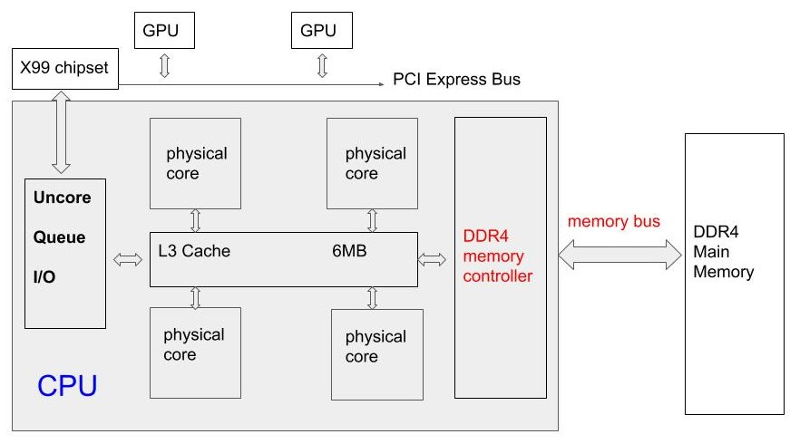

**Q: Last time, we talked about multi-threading techniques in parallel programming. I saw the 4-thread version of the code doesn't show good speedup in your 4 core/8 thread (4C/8T) laptop, why?**
A: Generally speaking, there are only two factors of a computer's performance. One is the power of CPU (frequency, number of cores, number of ALU and FPU, registers, etc.), and the other is the memory, so a short answer to your question is MEMORY.
**Q: Memory? I think the memory is sufficient. The entire matrix is just 20MB, but your laptop has 12GB memory available, I believe.**
A: The size of memory is enough, but the bandwidth of memory is already saturated.
**Q: Bandwidth? What does it mean?**
<!-- more -->
A: It means the amount of data can be transferred from the main memory to CPU per second through the **memory bus**. Because the data (matrix in our example) is stored in the main memory, but the operations must be executed in CPU, so the data must be read in to the CPU's cache and then written back to the main memory.
**Q: I still can not image the picture of data transfer.**
A: Look at the following picture. Ignore the "uncore, queue, X99 chipset, GPU etc." for now. All the data directly accessed from CPU is from L3 cache. The data in the main memory is fetched by the memory controller to the L3 cache through the memory bus. The **most important** thing to be noted is all of the threads share the same memory bus, which means the bandwidth is a upper limit of the entire memory access rates of all threads.

**Q: I see, so I think there should be many kinds of bandwidth, because the data has to be transferred for many times before getting involved to the physical cores, like from memory to L3, from L3 to L2, from L2 to L1. **
A: No. The bandwidth is specifically referred to the transfer speed from memory to L3, because it is the bottleneck. Look at the following table

| Type of storage      | access latency (cycles) |
|------|:------------:|:--------:|:--:|
| L1 cache|4|
| L2 cache|11-12 |
| L3 cache|22|
| Memory|200-400|

**Q: What a huge latency between L3 cache and memory!**
A: Agree, so the bandwidth is critical for all memory-intensive programs.
**Q: Wait, what do you mean by "memory-intensive program"?**
A: As I said, there are two big factors of performance. If the bottleneck of a program is the capability of computation, like number of ALU, FPU, it is called a core-intensive program. If the computation capabilities are enough, but it starves for more data from the memory, which means it suffers from the bandwidth, it is called a memory-intensive program.
**Q：I see... Now I think I can guess the solution of my question "why our program can not show much speedup with more than 3 threads". More threads mean more data requests at the same time, so it puts more pressure to the memory controller and memory bus. For the 1-, 2-, 3-thread versions of our program, the amount of requested memory rate is not that big, so they are still core-intensive, which means more threads can provide more speedup. However, with 4 or more threads, the amount of requested memory rate hits the uppper limiter of the data transfer speed (bandwidth), so it becomes a memory-intensive program. It also explains why the time costs of 5-10 thread versions are quite similar, because all of them are limited by the same bandwidth! It means this code is never limited by computation units (e.g. ALU, FPU). Of course, there are no arithmetic operations at all.**
A: Correct! If the maximum score is 10, I would like to give you 20, because your answer already goes beyond your question.
**Q: Although I am correct, I feel sad because it means we can do nothing, except buying a new computer, to improve it anymore, because it already hits the hardware limit.**
A: Not really. In fact, the bandwidth is just in ideal situation. In most real-world cases, we can not reach that ideal bandwidth. For example, our matrix has 1800*2400 integer entries, so it occupies 16MB. To flip it, we need to read and write each entry once, so in total we have 16MB reading access and 16MB writing access. I did a bandwidth testing on my computer by an opensource tool (https://zsmith.co/bandwidth.php), it shows


Sequential read (64-bit), size = 128 B, loops = 2031091712, 49582.0 MB/s  
Sequential write (64-bit), size = 128 B, loops = 1002438656, 24462.2 MB/s  


Therefore, the ideal time cost of a program would be 9.87e-4 seconds. This value is valid for multi-threads programs, because it is the upper limit of memory access capability. It should be noted that the above value is just an rough estimation for reference. From our real time costs, we can see there is much space for optimization especially for vertiacal flipping. We need to do something to optimzie the memory access pattern to dig the memory access. The current pattern is not efficient. 
**Q: Oh? Access pattern?**
A: Yes. It relates to the structure of the memory. The DRAM is accessed one row at a time. Each row is the smallest amount of memory to be fetched (about 2-8KB in modern DRAMs), which means even the CPU only requests 1 integer (4 Byte), the memory controller will still fetch 2-8KB data from the main memory to L3 cache. The entire latency is 200-400 cycles as stated in the table before.
**Q: Hmm... In our code, I think it requests the matrix's entries one by one. It is tatally a waste of time.**
A: Yes. **Accessing memory should be in large chunks**. We hope the CPU can fetch all the needed data to the caches at first and do some flipping operations within the caches, then write them back to the main memory.
**Q: Yes, please tell the CPU "hey, put this chunk of data into the cache, and then just use data in the cache".**
A: Unfortunately, that's hard, almost impossible. The reason is caches are totally hideen from programmers and they are handled automatically by the OS...
**Q: ... I am waiting for your "but".**
A: But, programmers can always give some hints to the OS to use the caches more efficiently. For example, if a chunk of data is frequently used within a loop, that amount of data will be cached. Here are the memory optimized versions of our codes

void *MTFlipHMem(void *tid){
    int *buffer;
    int ts = *((int*)tid);
    ts *= row/num_threads;
    int te = ts+row/num_threads-1;
    buffer = (int*)malloc(col*sizeof(int));
    
    for(int i=ts;i<=te;i++){
        memcpy((void*)buffer, (void*)matrix[i], col*sizeof(int));
        for(int j=0;j<col/2;j++){
            int temp = buffer[j];
            buffer[j] = buffer[col-j-1];
            buffer[col-j-1] = temp;
        }
        memcpy((void*)matrix[i], (void*)buffer, col*sizeof(int));
    }
    free(buffer);
}

void *MTFlipVMem(void* tid){
    int *buffer, *buffer2;
    int ts = *((int*) tid);
    ts *= row/num_threads;
    int te = ts+row/num_threads-1;
    buffer = (int*)malloc(col*sizeof(int));
    buffer2= (int*)malloc(col*sizeof(int));
    for(int j=ts; j<=te; j++){
        memcpy((void*)buffer,  (void*)matrix[j], col*sizeof(int));
        memcpy((void*)buffer2, (void*)matrix[row-j-1], col*sizeof(int));
        
        memcpy((void*)matrix[row-j-1],  (void*)buffer,  col*sizeof(int));
        memcpy((void*)matrix[j],        (void*)buffer2, col*sizeof(int));
    }
    free(buffer);
    free(buffer2);
}

In the innermost loop of **MTFlipHMem()**, only the buffer is used and its value is got from **memcpy()**. In the **MTFlipVMem()**, the **memcpy()** replaces the previous one-by-one memory access pattern.
**Q: What's the speedup of this optimization?**
A: Look at the timing information below


Time cost to vertically (MT version, TH = 1) is 3.939e-02 seconds. 
Time cost to horizontally (MT version, TH = 1) is 4.494e-03 seconds. 
Time cost to vertically (MT version, TH = 2) is 2.014e-02 seconds. 
Time cost to horizontally (MT version, TH = 2) is 2.834e-03 seconds. 
Time cost to vertically (Memory Opt) (MT version, TH = 1) is 4.851e-03 seconds. 
Time cost to horizontally (Memory Opt) (MT version, TH = 1) is 2.868e-03 seconds. 
Time cost to vertically (Memory Opt) (MT version, TH = 2) is 3.607e-03 seconds. 
Time cost to horizontally (Memory Opt) (MT version, TH = 2) is 2.020e-03 seconds. 


Remember our previous estimation? 9.87e-4 seconds. We are very close to it! (50% of ideal bandwidth is already very high)
The speedup due to the optimization of memory access pattern is summarized in the following table

|Tables|speedup|
|------|:------------:|:--------:|:--:|
|vertical flip|12X|
|horizontal flip|1.4X|

The reason why the vertical flipping has much more speedup than the horizontal flipping is the horizontal flipping is already close to the ideal bandwidth limit.
**Q: Nice. Now I know the limit of the hardware and how to program the software to reach that limit. At this stage, I can say "we can not improve this program anymore on this computer" with confidence.**
A: No...You can.
**Q: Why?**
A: Look at the NVIDIA logo on my laptop, which means it has GPU card installed. When the CPU is burnning the calories at the full speed, the GPU is just sleeping there. Why not wake it up?
**Q: I am eager to dive into the GPU world.**
A: See you next time. All of today's code is available here: https://onlinegdb.com/SJhVBUJU4. If you want to learn more details, please go to buy the book: [Tolga Soyata. GPU Parallel Program Development Using CUDA. Chapman and Hall/CRC, 2018.](https://www.crcpress.com/GPU-Parallel-Program-Development-Using-CUDA/Soyata/p/book/9781498750752)