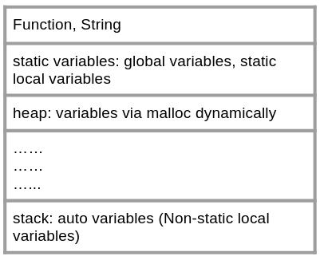

This blog is about the Chinese translation of a good C language book named "[征服c指针](https://book.douban.com/subject/21317828/)" by a Japanese programmer [Maebasi Kazuya](https://www.amazon.com/Kazuya-Maebasi/e/B004LT29A0). I found it is far from a complete guide for C, but a very good book clarifying some seemly basic but extremely important concepts, e.g. array, pointer, string, memory etc. The author didn't just list the knowledge one by one in the style which most textbooks did. Instead, he divided into several problems which made him feel confused and then give the solutions. It is a very valuable supplementary and eye-opening book for every programmer. In this blog, I will show some code to illustrate some concepts. Readers can go to [onlinegdb.com](https://www.onlinegdb.com/) to practice, which allows users to even debug online.

Before we start, I have **3 most important points**:

1 When you encounter some strange syntax in C, do not try to find some ways to explain to make the C more natural. Just remember that strange syntax, because C itself is strange indeed.
2 Array is not equivalent to pointer.
3 Many people talk about "constant string", but sometimes, the string can be modified.

<!-- more -->
## 1 Pointer
* When we talk about pointers, what do we talk? Answer: I don't know.
In many cases, we hear about many people say "This pointer is blablabla", but we should confirm that pointer is a data type in C. Unlike the basic data type like int, char, double, etc, pointer is a derived data type. A variable with pointer type also has its name, value, location in memory and so on. It's better to clarify what we are talking about, variable? value? or others? This is very important, because it has to do with many concepts, like left value and right value (refer the book to learn).

* In declaration of a pointer variable, does the pointer type consist of the asterisk sign? Answer: Hard to say. It depends.
In fact, pointer has an issue at the beginning:

int* p;

The above line declares a pointer variable p pointing to int. "Pointer pointing to a int" is represented by int\*. It means the int\* acts as a whole thing. However, when you want to declare multiple pointers in one line, you have to deplicate the asterisk sign for each pointer variable.

int *p1, *p2, *p3;

In this case, the \* and variable name act as a whole thing. This syntax is not natural.

* Because pointer stores the address in memory (8 bytes for 64-bit OS), why should we distinguish a pointer pointing to int and another pointer pointing to char? Are they different? Answer: For pointer operation.
First of all, in an expression, if a sterisk is added before a pointer, it means to retrieve the value of what it points to. If we do not tell how many bytes this pointer points to, it can not retrieve the value correctly when facing those 0 and 1 in memory.
Secondly, if we plus 1 to a pointer, we will get a new address. This new address is not simply add 1 to the address value. The size it will increase is equal to the size of the data type which it points to. Someone may ask how about void\*? It does not assign any specific data type, how many bytes it will increase when +1? My test is it will increase 1 byte. See below

int  a = 1;
char b = 'x';
int array[3];
int* p_a = &a;
char* p_b = &b;
void *p_c = &a;
int (*p_array)[3];
p_array = &array;

printf("The value of p_a   is %p.\n", p_a);
printf("The value of p_a+1 is %p.\n", p_a+1);
printf("The value of p_b   is %p.\n", p_b);
printf("The value of p_b+1 is %p.\n", p_b+1);
printf("The value of p_c   is %p.\n", p_c);
printf("The value of p_c+1 is %p.\n", p_c+1);
printf("The value of p_array   is %p.\n", p_array);
printf("The value of p_array+1 is %p.\n", p_array+1);



The value of p_a   is 0x7ffc3122139c. 
The value of p_a+1 is 0x7ffc312213a0. 
The value of p_b   is 0x7ffc3122139b. 
The value of p_b+1 is 0x7ffc3122139c. 
The value of p_c   is 0x7ffc3122139c. 
The value of p_c+1 is 0x7ffc3122139d. 
The value of p_array   is 0x7ffc312213a0. 
The value of p_array+1 is 0x7ffc312213ac. 


The pointer to int increases 4 bytes, while the pointers to char and void increase 1 byte respectively. The pointer to int[3] increases 12 bytes, because the size of int[3] is equal to 12, which will be explained later.

## 2 Array
Like int, char, double, etc, they are scalar and basic type, but array is not. Array is an aggregate and derived data type.
* When reading in arrays, the square brackets have nothing to do with the array concept. It is just a syntax sugar to pointer. p[i] is just a syntax sugar of \*(p+i), which can also be written as \*(i+p) or i[p].

int array[3]={10,20,30};;
printf("The array[1] is %d.\n", array[1]);
printf("The *(array+1) is %d.\n", *(array+1));
printf("The 1[array] is %d.\n", 1[array]);



The array[1] is 20. 
The *(array+1) is 20. 
The 1[array] is 20. 



What is more important than i[array]==array[i] is do not write this line.


## 3 Array is used as pointer in some cases（array is not pointer）
Although array is aggregate, while pointer is a scalar, but in many cases, they are pretty similar.
* When we talk about "Array is equal to pointer", what do we talk? Answer: The name of the array is actually the pointer pointing to it's first element in some situations.

For example, in the dummy parameters of a function, [ ] is equivalent to \*.

void function(int *p)
void function(int p[])

If you want to get a pointer pointing to the entire array, we need to use &array, see below

int array[3];
int *p_1;
int (*p_2)[3];
p_1 = array; //correct
p_1 = &array; // wrong, assign a int*[3] to int*
p_2 = array; // wrong, assign a int* to int*[3]
p_2 = &array; // correct

Note： for some unknown reasons，onlinegdb.com does not report any errors for the above code. But all of other compilers will report the errors. Therefore, the relationship between array and pointer is

1 In **expression**, **used as right value**, the name of the array is just a pointer pointing to its first element. (What is right value? Please refer to the book)
2 If we put & before the name of the array, it becomes a pointer pointing to the entire array.


## 4 Array is not equal to pointer
* Is any good example for this? Answer: Yes, see the space it occupies.
We all know, the size of array is number of elements multiply the size of its each element. However, the size of pointer is fixed for a specific machine. For 32-bit machine, it is 4 bytes, while for 64-bit, it is 8 bytes. See below

int a;
int *p;
int array[10];
int *array_p = array;
int *array_of_pointer[10];
int array2d[2][3];
printf("The size of a is %d.\n", sizeof(a));
printf("The size of p is %d.\n", sizeof(p));
printf("The size of array is %d.\n", sizeof(array));
printf("The size of array_p is %d.\n", sizeof(array_p));
printf("The size of array_of_pointer is %d.\n", sizeof(array_of_pointer));
printf("The size of array2d is %d.\n", sizeof(array2d));



The size of a is 4. 
The size of p is 8. 
The size of array is 40. 
The size of array_p is 8. 
The size of array_of_pointer is 80. 
The size of array2d is 24. 


int occupies 4 bytes，address occupies (64-bit machine) 8 bytes，array occupies 10*4=40 bytes, array_of_pointer occupies 10*8=80 bytes, and the 2D array occupies 2*3*4=24 bytes.

* Except the above case, any other difference? Answer: At least for string, there are much difference also.
The essence of string is array of char, instead of pointer pointing to char. See below:

printf("The size is %d.\n", sizeof("Felix"));



The size is 6.

  

The size if 6, because it adds a '\0' at the tail. If string is a pointer, the size should be 8.
However, the following issue is extremely confusing!

char *str
str=”abc”; 

The array of char acts as a pointer in the expression, so both sides are pointers, it is legal.
But

char str[4];
str = “abc”;

is illegal! Because str is array, when it appears on the left side, it can not be used as a right value, so can not be treated as a pointer, so can not receive the assignment from "abc". HOWEVER, there is another exception. It is the initialization of array by a string.

char str[4] = “abc”；

is legal.
Up to now, we have grasped 2 ways to deal with string. One is using pointer, and the other is using array. It goes back to our initial question: what's the difference? Answer: One is a constant, the other is a variable, because their locations in memory are different. See below:

char *str1 = "abc";
str1[0] = 'w';



Segmentation fault.


The above string can not be modifed, because it is a constant. However, in following case, the string can be modified

char *str1 = "abc";
printf("The address of \"abc\" is %p.\n", str1);

char str2[] = "def";
printf("The address of \"def\" is %p.\n", str2);
str2[0] = 'w';
printf("The str2 is %s.\n", str2);



The address of "abc" is 0x400ab4. 
The address of "def" is 0x7ffc6960c770. 
The str2 is wef. 


From the above output, we find the address of "abc" is very small, but that of "def" is very large, indicating that they are stored at different places in the memory. The "abc" is read-only, while the "def" can be modifed. Next question is why the small address is read-only, but large address can be modified? See the next section.

## 5 Memory
In fact, in the process of a C program, the information needs to be saved in memory: function, calls, variables and so on. Their order is

The constant string is placed in the same area with the function, which is read-only. In the example in Section 4, when a pointer is used to be receive a string, a constant string has been save in to the read-only area before that. However, when an array is used to receieve a string, in fact, it is just a assignment using several 'char' to fill in the places which the array occupies.

If you want to read, please go to (Kindle & paperback)([Buy the book!](http://www.ituring.com.cn/book/1036))