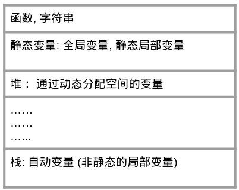

这篇博客有关一本C语言书《征服C指针》，作者是日本软件工程师[Maebasi Kazuya](https://www.amazon.com/Kazuya-Maebasi/e/B004LT29A0)（前桥和弥）。这不是一本有关C语言的完全指南，但是是一本用来厘清少量看上去很基础但是确实很重要概念的书，比如指针，数组，字符串，内存等等。作者不是像大部分教科书那样把所有的要点一一罗列，而是他逐步提出了几个让自己疑惑的问题，然后逐一解答。我觉得，对于每一位程序设计师，即便不用C语言,这是一本非常有价值，而且让人大开眼界的书，因为很多概念与语言无关。在解释某些概念时，会展示一些代码，读者可以跳转到[onlinegdb.com](https://www.onlinegdb.com/)进行现场的实践. 这个网站的好处是可以在线用gdb调试简单程序。

在正式开始之前，有3句话是本博客**最想说的**：

1、当你遇到某种奇怪的语法的时候，不要试图寻找某种方式或者某个角度去理解以达到使其显得更加自然的目的，直接记住就好，因为c语言本身就是奇怪的，不自然的。
2、数组不等于指针。
3、经常听人们说“字符串常量”，但是字符串有时候还真不是常量，是变量。

<!-- more -->
## 1 指针
* 当我们谈论指针的时候，我们在谈论什么？答：不知道。
很多时候，我们经常听到有人说“这个指针怎么样怎么样”，但是我们需要先确定一下，指针是一个数据类型，但它不是基本数据类型(int, double, char...)，而是派生数据类型。就像其他基本数据类型的变量一样，指针数据类型的变量也是有变量名，变量的内容，以及变量在内存中存在的地址等信息。当我们谈论指针的时候，最好需要搞明白我们谈论的是指针类型的变量还是指针类型的值？这个很重要，牵扯到很多概念，比如左值、右值。

* 指针变量声明时，指针类型包不包含星号？答：很难说，因为有矛盾。
其实指针在一开始就有一个坑，那就是指针变量的声明：

int* p;

这句代码声明了一个指向int数据类型的指针变量p, 其中“指向int的指针类型”用int\*表示，也就是说int和\*是整体，但是当在一行声明多个指针的时候，只能写成

int *p1, *p2, *p3;

这个时候\*跟变量名又变成了整体，这个规定很不自然。

* 既然指针变量保存的是内存地址，对于64位计算机，也就是8个byte的“门牌号”，那为什么还要区分指向int的指针和指向char的指针？他们不一样吗？
答：不一样，因为要照顾到指针运算。
第一，如果在表达式中，一个指针变量前加一个\*，代表解引用，也就是取出这个指针指向的数据。如果指针对指向的数据类型不作区分，那么当面对一堆0，1时，计算机不知道要读几位, 无法正确地按照格式取出数据。注意，这里面又有一个坑，那就是表达式中的\*代表取出指针所指向的数据内容，跟在声明中的\*的意义是不一样的。
第二，指针加法运算。对指针+1，意味着得到一个新的地址，这个地址可不是原地址+1，而是原来指针的地址加上被指数据类型的大小。如果不限定类型，就不知道地址要移动几位. 当然，有的人可能会质疑，因为C语言中有void\*指针，并没有限定数据类型，就是一个单纯的地址，那如果+1会移动几位？加1位。为了解答，看下面的例子比如

int  a = 1;
char b = 'x';
int array[3];
int* p_a = &a;
char* p_b = &b;
void *p_c = &a;
int (*p_array)[3];
p_array = &array;

printf("The value of p_a   is %p.\n", p_a);
printf("The value of p_a+1 is %p.\n", p_a+1);
printf("The value of p_b   is %p.\n", p_b);
printf("The value of p_b+1 is %p.\n", p_b+1);
printf("The value of p_c   is %p.\n", p_c);
printf("The value of p_c+1 is %p.\n", p_c+1);
printf("The value of p_array   is %p.\n", p_array);
printf("The value of p_array+1 is %p.\n", p_array+1);



The value of p_a   is 0x7ffc3122139c. 
The value of p_a+1 is 0x7ffc312213a0. 
The value of p_b   is 0x7ffc3122139b. 
The value of p_b+1 is 0x7ffc3122139c. 
The value of p_c   is 0x7ffc3122139c. 
The value of p_c+1 is 0x7ffc3122139d. 
The value of p_array   is 0x7ffc312213a0. 
The value of p_array+1 is 0x7ffc312213ac. 


int指针前进了4个字节，char和void指针都前进了1个。int[3]指针前进了12个字节。有关数组的指针，也是很容易弄错的，后面会详细讲。

## 2 数组
像int, char, double等等，都是scalar，但是数组不是，而是聚合类型(aggregate)。
* 在读取数组是,方括号跟数组没有任何关系。在读取数组的时候p[i]仅仅是\*(p+i)的语法糖，写成i[p]也是可以的

int array[3]={10,20,30};;
printf("The array[1] is %d.\n", array[1]);
printf("The *(array+1) is %d.\n", *(array+1));
printf("The 1[array] is %d.\n", 1[array]);



The array[1] is 20. 
The *(array+1) is 20. 
The 1[array] is 20. 



比i[array]==array[i]更重要的是不要写i[array]，这不是人类的理解方式...


## 3 数组可以当作指针来使用的情况（数组不等于指针）
虽然数组是聚合类型,而指针是标量, 但是他们有很多相似之处. 经常会发现数组跟指针很像，这是有道理的。
* 当我们在谈论“数组等于指针”的时候，我们在谈论什么？答：数组变量名其实就是“指向该数组第一个元素的地址”的指针。
比如在声明函数形参的时候，[ ]与\*等价。

void function(int *p)
void function(int p[])

但是数组变量名并不是指向自己(数组)的指针, 只有数组名前面加&，才是指向该数组的指针，如下例:

int array[3];
int *p_1;
int (*p_2)[3];
p_1 = array; //correct
p_1 = &array; // wrong, assign a int*[3] to int*
p_2 = array; // wrong, assign a int* to int*[3]
p_2 = &array; // correct

注：由于某些原因，onlinegdb.com居然没有报错，但是在其他任何平台都会报错。也就是说数组跟指针有如下关系：

1 在**表达式**中, **当作右值使用时**，数组名其实就是指向其第一个元素的指针（什么叫右值？看书就明白了。）
2 数组名前加&是指向数组这个整体的指针，此时这个指针指向的已经不再是基本类型，而是聚合类型


## 4 数组不等于指针
* 有没有一个好的例子来证明这句话？答：有，看所占空间的大小。
我们知道，数组的大小应该是元素的个数乘以每个元素的大小，但是指针的大小在某台固定的机器上是一样的，比如32位机器应该是4个byte，64位机器应该是8个byte，例子证明

int a;
int *p;
int array[10];
int *array_p = array;
int *array_of_pointer[10];
int array2d[2][3];
printf("The size of a is %d.\n", sizeof(a));
printf("The size of p is %d.\n", sizeof(p));
printf("The size of array is %d.\n", sizeof(array));
printf("The size of array_p is %d.\n", sizeof(array_p));
printf("The size of array_of_pointer is %d.\n", sizeof(array_of_pointer));
printf("The size of array2d is %d.\n", sizeof(array2d));



The size of a is 4. 
The size of p is 8. 
The size of array is 40. 
The size of array_p is 8. 
The size of array_of_pointer is 80. 
The size of array2d is 24. 


发现int占4个字节，地址(64位计算机)占8个字节，array数组占10x4=40个字节，array_of_pointer占10x8=80个字节，array2d占2x3x4=24个字节

* 除了上面这个大小的问题，还有哪些不同？答：至少在字符串方面很不一样。
对于字符串，也有数组与指针的不同。字符串的本质是char的数组，而不是指向char的指针，下面代码可以验证这一点：

printf("The size is %d.\n", sizeof("Felix"));



The size is 6.

  

大小是6，因为字符串在末尾加了’\0’。如果字符串本质是指向char的指针，那大小应该是8。
但是接下来的问题非常confusing

char *str
str=”abc”; 

char的数组在表达式中解读为指针，所以=左右两边都是指针，这是一个普通的指针的赋值，是合法的。
但是

char str[4];
str = “abc”;

是非法的，因为str是数组，当它出现在=左边的时候，是当作左值使用，只有作右值时才可以看成指针，此时str不能看作指针，所以无法接受”abc”的赋值。但是，一个例外就是初始化！初始化不同于普通的赋值操作

char str[4] = “abc”；

是合法的。
也就是说，目前我们掌握了两种声明字符串的方法，一种是用指针，一种是用数组。又回到了我们的中心问题：数组跟指针有啥区别？这两种方法有什么不同吗？答案就是：一个是字符串常量，不能修改，一个是字符串变量，可以修改。因为这两种方式定义出来的字符串在内存中存放的位置完全不同。如下

char *str1 = "abc";
str1[0] = 'w';



Segmentation fault.


但是，如果用数组来保存字符串，就会变得可以修改。

char *str1 = "abc";
printf("The address of \"abc\" is %p.\n", str1);

char str2[] = "def";
printf("The address of \"def\" is %p.\n", str2);
str2[0] = 'w';
printf("The str2 is %s.\n", str2);



The address of "abc" is 0x400ab4. 
The address of "def" is 0x7ffc6960c770. 
The str2 is wef. 


从上面的例子发现，”abc”的地址很小，而”def”的地址很大，这其实就预示着它们保存在了内存中的不同区域，一个仅仅只读，另一个却可以修改。那为什么地址小就无法修改，地址大就可以修改？请看下一段。

## 5 内存相关
事实上，在c语言执行的过程中，信息需要保存在内存中，包括函数，调用信息，各种变量等等，它们的存放顺序是

字符串常量被放在了跟函数自身相同的区域，也就是不能修改的。上面的例子中，当用指针来接受一个字符串的赋值之前，事实上该字符串已经以常量的形式保存在了跟函数自身相同的内存区域里，而通过数组来初始化字符串的时候，该字符串保存在了自动变量的区域，所以是可以修改的。

想看就请购买吧，如果不在中国，也有kindle电子版：([去买书](http://www.ituring.com.cn/book/1036))