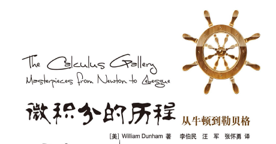

牛顿，一个总结出统治经典物理的力学三定律的先驱，一个发现天体运转规律的预言者，一个耐心地把无穷级数和逆级数玩转的魔术师，一个经常写一个漂亮的公式但就是不说自己是如何得到的怪才，一个把24K纯机械怀表当鸡蛋煮的英国贵族，说：“我只是一个在海边玩耍的小孩，偶尔捡起了几个美丽的贝壳，但是对于真理的大海，我却丝毫没有发现。”我一度觉得这就是牛顿在谦虚，但是看了这本书才发现，如果说牛顿谦虚，那么不仅莱布尼兹会不服，而且在此后的几百年里，伯努利，欧拉，柯西，黎曼，刘维尔，魏尔斯特拉斯，康托尔，沃尔泰拉，贝尔，勒贝格等一大批人先后驾着帆船去与凶险的海浪搏斗，用实际行动告诉了我们牛顿确实没发现真理的大海。这本由美国著名数学作家William Dunham写的《微积分的历程—从牛顿到勒贝格》正是一本记录了微积分发展历程中最精彩事件和最主要定理（含证明过程）的书。第一次在图灵社区看到这本书的时候，看书名以为是一本以记史为主的轻科普书。但在仔细读过第一章之后，就发现这本书其实可以当做半个教材使用了，因为里面的公式和证明都非常详实。这本书依照历史发展的顺序，记录了从微积分这个概念被提出的17世纪60年代到测度论基本建成的20世纪初，这300年之间的思想的起伏。在读这本书的过程中，一开始心里是惴惴不安的，因为这本书居然直接用一些令人瑟瑟发抖的人名作为章节的标题，比如第4章-欧拉，第6章-柯西。不过在深入其中之后，倒是觉得里面的人物变得温和起来，这些大数学家一个个都是有血有肉的人，比如牛顿遇到棘手的问题也会搪塞回避，面对比自己强的竞争对手莱布尼兹也会拉帮结派搞学术政治；伯努利兄弟为了谁先解出难题而耿耿于怀；柯西甚至没有完全理解以自己的名字命名的“柯西序列”（就像鲁迅不会做自己文章的阅读理解一样）等等。这本书是近期读过的最精彩的书，没有之一，对比以前度过的分析学教材，这个是第一本让我能看得懂里面99%证明题目的书，而且深度也是够的。下面就简单回忆一下这本书的内容。
<!-- more -->
## 1. 早期
在早期，为了求解曲线下的面积，牛顿、莱布尼兹提出微积分。在那之后，分析学家其实就是无穷级数学家，因为他们都在比谁能把无穷级数这门技术玩到极致。伯努利兄弟接过了恩师莱布尼兹的大旗，同样坚信无穷级数是进入分析学的必由之路。雅各布·伯努利发现了调和级数发散，约翰·伯努利也发现了$x^x$的积分可以表示成一个无穷级数，并且抽空还培养了一位研究生--欧拉同学。欧拉特别喜欢计算积分，当然跟莱布尼兹是一脉相承的，最善于用无穷级数去辅助求各种复杂的积分。这里值得一提的是当无穷级数遇到$\pi$的魔力。我们知道古代中国数学家祖冲之在公元5世纪已经把圆周率精确到了7位小数，然后这个记录被打破是15世纪的阿拉伯数学家—卡西（精确到了17位），前后一共1000年，把精确度推进了10位小数。现在我们把眼光移向欧洲，在16世纪的韦达用正393216多边形把$\pi$精确到了第9位小数，没多久之后依然在16世纪，科伊伦用纯手工计算的方式，用2^62边形把$\pi$精确到了35位小数，这个计算耗费了他一生的时光。他们用的方法都是割圆术，然后到了18世纪，欧拉就用一个无穷级数的简单公式轻松超越了之前所有人，用这个公式计算到第20位小数也就大约1小时，这就是算法的力量。
## 2. 第一次波折
在莱布尼兹发表第一篇微积分论文之后的第99年，欧拉辞世。在这么多位卓越先驱的呵护下发展了近一个世纪的微积分，此时依旧脆弱不堪，很多底层的假设大多依靠直觉而不是推理。牛顿所提出来的“逐渐消失的量”成了各大反对者批评的对象。英国著名的哲学家和克罗因教区的主教—柏克莱写了一篇标题很长的文章，题目是《致一位不信教的数学家的评论，其中剖析现代分析学的目标、原理和结论是否比宗教的神秘和教义有更清晰的构思或更缜密的推理》。很显然，此时的微积分在神学家看来，成为了攻击数学家们的最有力武器。而且这位柏克莱主教说了一句让我拍手称绝的话：“错误也许能产生真理，但是绝不会产生科学”。这也是我认为西方现代科学最美丽的部分，不是只看重某个结果是否正确，而是更关注产生这个结果的过程是否严谨和科学，这保证了科学的每一点进步都是无比坚实的，这也恰恰是东方哲学中最欠缺的。我们知道，当一个东西处于风口浪尖的时候，往往会吸引来一大批关注者，比如拉格朗日就发表过一篇文章，用无穷级数来代替微分，巧妙绕开了“逐渐消失的量”，本来自信满满以为功成名就的时候，遇到了一个柯西举出的反例和质疑，立刻被抛弃。没错，这本书关于拉格朗日这位大数学家的篇幅就这么多，不管他在其他领域的成就多么伟大，在普鲁士科学院的头衔多么高，在微积分底层逻辑构建的大潮中，他只是大胆地做了一次不那么严谨的尝试就被严厉驳倒，在科学面前，人人平等。那么真正迈出坚实第一步的是谁？没错，柯西！
## 3. 攻坚期
19世纪的柯西，用精湛的手法证明了介值定理、中值定理以及微积分的基本定理，而且找到了两个很具体的级数收敛判别法则。更重要的是，他第一次明确了积分学相对于微分学的独立地位，这一点是欧拉所没有认识到的。事实上，当我读到柯西的时候，感觉他并没有提出多少惊世骇俗的新概念，但是作者也说这一章的篇幅却是最长的。我觉得，数学的发展或许可以分成两类，第一类是像牛顿、莱布尼兹一样，提出新概念的轮廓，让人们心之向往；第二类是像柯西这样，对一个模糊的轮廓进行精确的刻画，让人们能触摸到每一处纹理。这两类的贡献，缺一不可，柯西的贡献绝对是不亚于牛顿的。在柯西确立了积分独立地位之后，随着对严密性研究的深入，曲线的几何直观越来越被淡化，取而代之的是抽象的函数，并且函数的样子越来越奇特。比如狄利克雷函数，在实数上处处不连续，如何定义积分？柯西的定义法此时就不行了，这个时候黎曼站了出来，提出了黎曼可积性的充分必要条件（证明过程很精彩），证明狄利克雷函数不可积，因为它‘太’不连续了。大家都知道，数学家不喜欢用‘太’‘很’这样的词，因为不够定量，他们总是希望得到一个可以测量的指标来说明问题，所以这里就引申出来一个核心问题：到底一个函数不连续到什么程度才会变得不可积？这个问题，要到50年之后，勒贝格站在黎曼这个巨人的肩膀上才得以攻克。那么在这50年之间，数学家们也没有闲着。前面说的都是等式，刘维尔通过一个不等式，发现了无理数与有理数之间的空隙，并且通过亲手构造了一个超越数而证明了超越数的存在。威尔斯特拉斯更是励志典型，从中学教师一路干到柏林大学教授，然后被黄袍加身成为“现代分析学之父”。他从点态极限的缺陷中，提出了一致收敛的概念。在1875年，提出的一个处处连续却无处可微的函数，颠覆了所有人的认识，很多数学家纷纷表示要重塑三观。如果当时有网络自媒体，那么文章标题一定是“震惊！前中学数学老师竟然做出这种事，查尔斯·艾尔米特看了沉默，亨利·庞加莱看了流泪”。
## 4. 第二次波折
随着微积分越来越严密，人们构造了大量的不同不连续程度的函数，并且验证了其可积性，似乎之前那个函数可积性问题的答案越来越呼之欲出了，但就是没有捅破最后那一层窗户纸。最沉闷的时刻不过如此，保罗·杜布瓦·雷蒙认为黎曼的定义无法再改进了，于是他止步于此；而康托尔则另辟蹊径，从集合论的观点出发，掀起了一场现代革命。
## 5. 集合论与测度论
出生于音乐世家而具备浪漫主义情怀的康托尔，一直都在追求数学中超然的自主性。他发现了区间的不可数性，从而立刻证明了超越数的存在，并且因为超越数的不可数性，其数量远大于可数的代数数。这里康托尔与刘维尔形成了鲜明的对比。作者的一个比喻非常精彩，他说刘维尔就像一个勤劳的老农，在一片甘草堆里四处翻找，突然一根针刺痛了他的手指，他才发现原来还有针的存在。而康托尔只是轻松地变个魔术把你带到夜空下，让你看到代数数只是夜幕下的点点繁星，超越数才是浓黑的万里长空。接下来有了集合论这个手段，沃尔泰拉和贝尔对集合的稠密性，连续性与稠密性的关系进行了，函数的分类等问题进行了一系列探索，而这些所有数学家们的成果都成为了勒贝格的垫脚石。他提出的测度论一举解答了50年来困扰数学界的难题：黎曼可积性的充分必要条件是不连续点的集合具有零测度。在回答完这个问题后，他没有就此满足，在彻底理解了黎曼积分之后立刻放下了黎曼积分，把目光投向远方，提出了勒贝格积分，完美地证明了300年前牛顿和莱布尼兹提出的微积分基本定理，至此最后一块拼图也贴好了。无数的数学家们用300年的时间在外面兜兜转转，最后又回到起点。从肯定到否定，再到否定之否定，微积分的发展作为哲学课程的典型再好不过。

尾注：现代微积分教材中广泛使用的$\int$是莱布尼兹发明的，$f^{\prime}$是拉格朗日发明的，但是在书中的篇幅并不多，因为前者遇到了牛顿，后者遇到了柯西。

感谢图灵能引进这本让人酣畅淋漓的书，想看就请购买吧，如果不在中国，也有kindle电子版：([去买书](http://www.ituring.com.cn/book/147))

