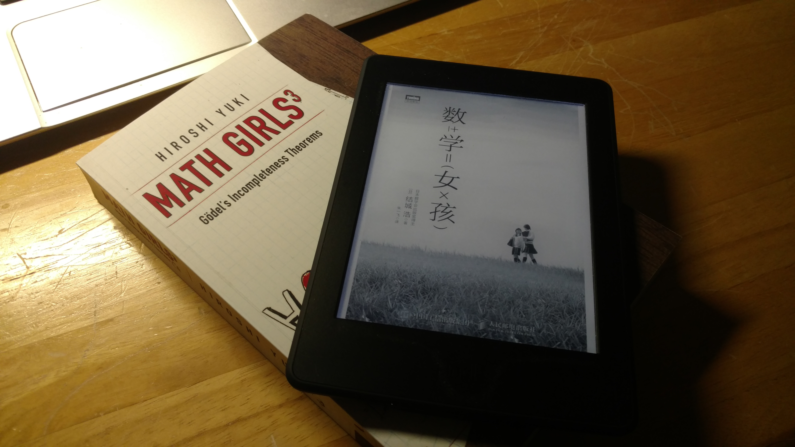

我是从图灵社区那里偶然看到《数学女孩》这套书的。当时看到的是第一部，刚翻了几页就觉得有意思，就立刻扫码购买了。这本书里面写的是几个日本中学生的日常学习（80%）和生活（20%），除了男主（高二）之外，还有三个女主，分别是同级的高中生米尔嘉，高一的泰朵拉，还有读初中（还是小学？）的远房表妹尤里。米尔嘉是个bug级的存在，作为一个高中生就已经参加国际数学会议，能听懂大部分内容，并且已经预定了去普林斯顿大学主修数学。男主的设定比较符合大部分人的水平，基础不错，逻辑性也较强。泰朵拉一开始特别惧怕数学，在数学学习上总是不得要领，不过在大家的帮助下，快速进步，达到了跟男主相似的水平。尤里是初中生，第三部里才进来，水平肯定不及其他三位，不过她属于那种非常善于思考的类型，有时候提出的数学问题，甚至能给其他人带来灵感和启发。所有的故事都是围绕他们四个人在学习数学中遇到的问题而展开，逐步深入，通过他们的谈话来引出一个又一个数学知识，让读者看到了他们面对数学时的热情，迷茫，偶尔犯晕与最后的自信满满。这也正是这个系列最吸引人的地方，它让我看到的不是像高斯、牛顿、爱因斯坦那种大神级别的人物，高高在上地向大众阐述着世界的真理。这个系列让我看到的是他们四个相互帮助并一起成长的过程。主人公们犯过错误，也走过弯路，但从他们的喜怒哀乐中，让我仿佛看到了曾经的自己，这无疑拉近了作者与读者的距离。
<!-- more -->

这个系列的作者是日本的程序员结城浩(Hiroshi Yuki)。写过程序的人都应该知道，编程其实是一件很耗时间和精力的事情，结城浩能在工作之余依然高产地写作，让我心生敬佩。目前日文版已经出在了第六部，多亏图灵社区的努力，前三部都有了中文版。前几天看到第四部也在翻译中。作者在后记中也说没想到会有这么大的反响，才决定出后续的几部，所以第一部没有副标题，第二部的副标题是费马大定理，第三部的副标题是哥德尔不完备性定理。每一部之间没有硬性关联，不过基本上里面涉及到概念是由浅到深的。说也惭愧，我虽然接受过大学高等教育，但是当看到第二部结尾部分的费马大定理的证明轮廓时就已经非常迷糊讲了，没有完全看明白。唯一的收获是看明白了一个费马大定理n=4时的一个特例的证明，也算是一种自我安慰。第三部的难度就已经很明显了，最后一章已经脱离了科普的范围，而是完全按照哥德尔博士的论文把哥德尔不完备性定理分成几十个小定理和定义去逐步证明和理解，我完全跳过了最后一章。作者结城浩在后记里也坦承，为弄懂哥德尔不完备性定理付出了巨大努力，自己阅读数理逻辑方面的教材，请教很多数学教授，前前后后花了一年的时间才写完第三部，这种为了解决难题而不断寻找解决方法的精神，值得我学习。

由于时间关系，这里我就不展开说了，只列举几个给我留下比较深刻印象的部分：

**第一部：**
**1. 证明质数有无穷多个。**
**第二部：**
**2. 群、环、域的由来 （让我明白，数学就是抽象，抽象，再抽象！）**
**3. 阿贝尔群**
**4. 费马大定理n=4的特例证明居然跟一个定理有关“不存在三边皆为自然数，而面积为平方数的直角三角形”**
**第三部：**
**5. 戴德金认为，整体和部分之间存在双向映射代表无限集合**
**6. 皮亚诺算术公理**
**7. 罗素悖论{x|x not belongs to x}是否是自身的元素**
**8. 有理数集是可数集**
**9. 实数集是不可数集（康托尔对角证明法）**
**10. 哥德尔第一不完备性定理: 满足相容、蕴含皮亚诺算术公理且可递归的形式系统，不存在A和非A的形式证明**
**11.  哥德尔第二不完备性定理：在满足上面条件的形式系统中，无法证明自身的相容性。所以如果想证明某个形式系统相容，就需要一个更‘强’的系统来证明它。**

时间有限，就写这么多，总之虽然没完全搞懂里面的知识，但是其探索精神是领略到了（这是让我跳过不懂部分的绝佳理由）。唯一让我不满意的是，三部下来，竟然只有男主在原地踏步！其他人都像坐着直升飞机在进步，比如第一部里米尔嘉像一个大学生的水平，第二部里像研究生，第三部里直接参加国际会议，转学去普林斯顿主修数学，快能跟跟数学家谈笑风生了。再比如第一部里泰朵拉最开始连左右极限都不懂，男主还颇有优越感地给她解释，在第二部里发现泰朵拉比自己更快地找到了一个问题的解法而开始怀疑自己，到第三部里，男主貌似也接受了被泰朵拉赶超的事实。尤里的进步无疑是最大的，因为本身几乎没有数学基础，到最后居然也在跟米尔嘉讨论哥德尔不完备性定理，让我觉得不可思议。也许这正是这本书叫《数学女孩》的原因吧，男主是用来用来衬托女孩们的进步的。

最后套用一句最让我觉得好笑的话来结束，第三部里的尤里说“数学书里经常有用于检查视力的符号（这里指存在符号\exists）。”那么为了学好数学，我要去做眼保健操了，再见！哦，最后附上图书的链接：
[数学女孩 1](http://www.ituring.com.cn/book/1675)
[数学女孩 2](http://www.ituring.com.cn/book/1677)
[数学女孩 3](http://www.ituring.com.cn/book/1859)