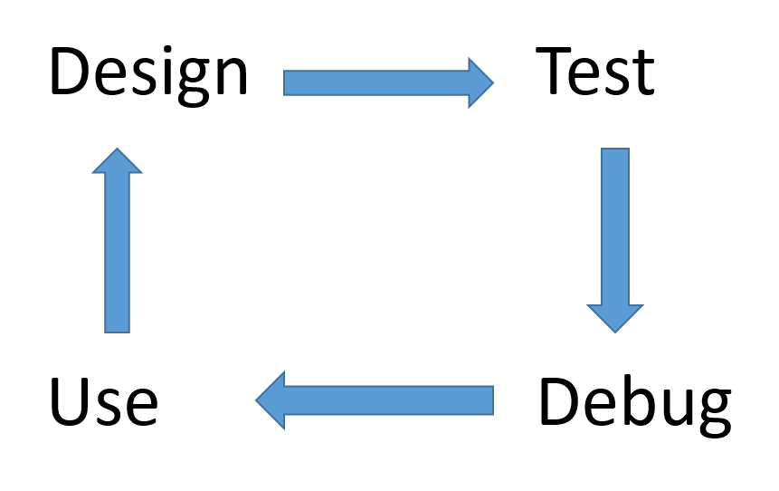

**Q: What are you doing recently?**
A: I am doing some scientific programming.
**Q: I hear about some programming languages, like C/C++, Java, Python, and so on. But could you tell me what’s the difference between the general purposed programming and scientific programming?**
A: In short, more extensive arithmetic operations on real numbers, which is represented by a number of floating point type in computers.
**Q: I think if the floating number can be represented in computers, there should not be too much difference from integer, right?**
A: Problems come here. Computer can’t represent a general real number in an exact manner. For irrational number, of course, we can only use an approximated number with its several leading digits. However, even for rational numbers, we can only use an approximation.
**Q: What kind of approximation? Or what’s the error?**
A: It depends. There are several types of floating point number: single-precision, double-precision and extended precision (IEEE 754 Standard). They have different level of accuracy. Look at this table

|Tables|unit round-off|max number|bits|
|------|:------------:|:--------:|:--:|
|single-precision|6.e-8|10^38|32|
|double-precision|2.e-16|10^308|64|
|extended-precision|5e-20|10^9863|80|

<!-- more -->
**Q: What’s the difficulty?**
A: In most general purposed programming, the logic operations are dominated, but for scientific programming, we do lots of arithmetic calculations, which may cause many problems, like NAN (not a number). Its occurrence is due to undefined operation, like 0/0, Inf/Inf, Inf-Inf, sqrt(-1), log(-1), etc.
**Q: How can I detect a NAN number?**
A: From the IEEE Standard, the NAN is the only floating point number which is not equal to itself. If $x==x$ fails, it must be a NAN.
**Q: What’s the most common arithmetic computation?**
A: Solve the linear equation $Ax=b$ efficiently.
**Q: x=A^{-1}*b, right?**
A: Right, but in numerical computation, you can’t get an exact inverse of A. Sometimes, the error is enormous. It can be indicated by the condition number of A, which indicates the error sensitivity of the matrix. This is why people use some precondition process to make the system to be well-conditioned.
**Q: Ok, maybe too much mathematics for me. Let’s talk about programming more. What language do you use to do your scientific computation?**
A: C/C++ and Matlab.
**Q: Why not Java? I think it is more popular in IT industry.**
A: The efficiency is not that high. I know there are at least two factors. First, Java is an intermediate language between compiled and interpreted languages. The source code written in Java will be compiled into ‘bytecode’ first and then interpreted by Java virtual machine (JVM). This interpretation will reduce the execution speed. The second thing is Java provides garbage collection. It’s a very user-friendly feature to avoid nearly 99.99% memory problems, but the price is to cost more. C/C++ is a completely compiled language and the garbage collection is handled by the developer themselves.
**Q: OK, I see. But why not Fortran? I know many scientists are using Fortran 2003, which provides OOP features also.**
A: I do not know much about Fortran 2003. It has some good features, like good compatibility with C (e.g. C_INT, C_FLOAT…). Maybe it is also related with many factors, like the history, software environment, etc. For languages themselves, C/C++ passes the arguments by value (copy the value of args onto the stack), but Fortran passes the arguments by reference (put the address of args onto the stack). Also for “multi-dimensional array”, C/C++ uses row-major storage order, but Fortran uses column-major order. There is no any preference for computers, but for developers with different habits, it really matters.
**Q: I see. Why you use quotation marks for “multi-dimensional array”?**
A: Fortran supports 2D array intrinsically, but C/C++ only has 1D array. The 2D array is represented by a 1D array of some 1D arrays.
**Q: You say developers with different habits would prefer C/C++ or Fortran, why?**
A: It relates with the efficiency of memory access. For example, if you want to do a matrix-vector multiplication. A is $m \times n$. For C/C++, the most efficient way is

for(int i=0;i<m;i++)
  y[i]=0
for(int j=0;j<n;j++)
  y[i] += A[i][j]*x[j]

For Fortran, the most efficient way is

for(i=0;i<m;i++)
  y[i]=0
for(j=0;j<n;j++)
  for(i=0;i<m;i++)
    y[i] += A[i][j]*x[j]

**Q: Why is reading the adjacent memory more efficient?**
A: It relates with the mechanism of computer’s memory. The big picture is when the CPU wants to process some data from memory, it will grab a block a memory containing those data into register and caches. The data access in register and cache is much faster than that in main memory. Look at the structure and the table
Register<-->L1 cache<-->L2 cache<-->main memory

|Pentium 4 CPU|Register|L1 cache|L2 cache|main memory|
|-------------|:------:|:------:|:------:|:---------:|
|access cost(ns)|0.4|1.0|8.0|150|

If the CPU can read the nearby data from register, the data access is 300X faster than grabbing it from main memory.
**Q: What a huge advantage!**
A: Yes. If a programmer likes row-major storage order, using Fortran will be a nightmare, and vice versa.
**Q: You mention about the memory. I wonder how the variables are stored in the memory?**
A: In fact, you can refer to my previous blog [Here](http://cfdplay.com/2017/12/08/c-pointer-20171209/). The allocating variables are stored in three regions: stack, fixed memory location and heap. The stack stores the local variables, which will be eliminated automatically when the function returns. The fixed memory location stores the global variables to be used by several different subroutines. Moreover, the local static variables are also here. The heap is good for storing large objects. When you use malloc or new, it tries to find a block of free memory and return a pointer to the start of that block of memory.
**Q: The heap sounds cool. If I malloc(10*sizeof(double)), so it will find a block of 8\times10=80 byte?**
A: Not really. In fact, the block is a little larger than 80 bytes, because for each block, it needs a small header to store the related information usually before the content block, like array size, which is used for deallocation, otherwise, the system doesn’t know how many bytes will be freed.
**Q: Heap is smart. I wonder how the system finds the proper free block? Just scan the memory directly? That will be too expensive, right?**
A: Good question. In fact, to facilitate this kind of searching, a memory heap may maintain two linked lists of pointers to blocks of memory. One (allocated list) contains the pointers to blocks of allocated memory, and the other (free list) contains the pointers to blocks of free memory.
**Q: Heap is very smart. Should we use heap as possible as we can?**
A: No. The allocation and deallocation have some overhead. That is to say, in a short and extensively repeated function, try to avoid using heap memory. The heap is good for large objects which have relatively long lifecycles.
**Q: Hmm, reasonable. In a previous question, I forget to ask. You say the C/C++ does not support 2D array, which is treated as 1D array of 1D array. For example, if I declare a dynamic “2D array”: A[10][20], the A[0][:] and A[1][:] may not locate at contiguous memory location.**
A: Exactly. You are right. The consecutive allocation calls can’t guarantee the memory is contiguous. 
**Q: What a sad thing…**
A: Wait, there is still a trick to satisfy your expectation. See this:

A = (double**) malloc(m*sizeof(double*))
A[0] = (double*) malloc(m*n*sizeof(double))
for(i=1;i<m;i++)
  A[i] = A[0]+i*n

A: Exactly. The contiguous allocation in heap memory will not only enhance the data access speed, but also avoid memory fragmentation. Just imagine that a heap, cut into 10K small blocks, is much less efficient than a heap, which is cut into 10 large blocks. 
**Q: Great! What else do you use to increase the efficiency?**
A: Not many. I still need to go deeper in this topics. There are many good books about efficient memory, which I have not read yet. You may also hear that C++ is slower than C. Programmers should avoid excessive object creation and destruction by using the reference of the arguments, like:

int func(const Object &y) const;

Also, using inline functions can reduce the function call overhead. In fact, the efficiency is highly related with locality. There are two types of locality: temporal locality (executed code) and spatial locality (data distribution). The row-major and column-major order is a good example of spatial locality. For the temporal locality, try to reduce function calls, which normally lead to setting up of stack frames.
**Q: What’s the cost of the various arithmetic operations?**
A: plus and minus cost 1 clock cycle. Multiplication costs 1~2 cycles. Divide costs about 26 cycles. Try to use less divide. Use x*0.5 instead of x/2.
**Q: Wow, you need to remember all of the above tips when you are programming? That’s a huge burden!**
A: Not really. The modern compiler becomes stronger and stronger. It already do many optimizations for us, e.g.
(1)	Common sub-expression elimination
(2)	Code hoisting
(3)	Dead code elimination
(4)	Code inlining
(5)	Register allocation
(6)	Strength reduction
Here I will give an example of Code hoisting. The original source code is

int i,j;
double sum=0.;
for(int i=0;i<m;i++)
  for(int j=0;j<n;j++)
      sum+=A->me[i][j];

After the optimization by compiler, the code will be

int i,j;
double sum=0., **A_me, *A_me_i;
A_me = A->me;
for(int i=0;i<mi++){
    A_me_i = A_me[i];
    for(int j=0;j<n;j++)
      sum += A_me_i[j];
}

The compiler will remove the quantities that are independent of the loop index out from the loop. The orignal source has 2 memory address computation and 3 memory access for each increament, but the optimized version only has 1 memory address computation and 1 memory access. Developers do not have to worry about this kind of optimization.
**Q: With these wonderful skills as well as tricks, I believe you can develop very fast.**
A: Not really. Software development is an endless cycle. Look at this

Q: Maybe I have bothered you too much.
A: Doesn't matter, I need to take a rest apart from the design, test, debug and use.
Q/A: See you next time!
**Reference**
[Oliveira, Suely, and David E. Stewart. Writing Scientific Software: a guide to good style. Cambridge University Press, 2006.](https://www.amazon.com/Writing-Scientific-Software-Guide-Style/dp/0521675952/ref=mt_paperback?_encoding=UTF8&me=)